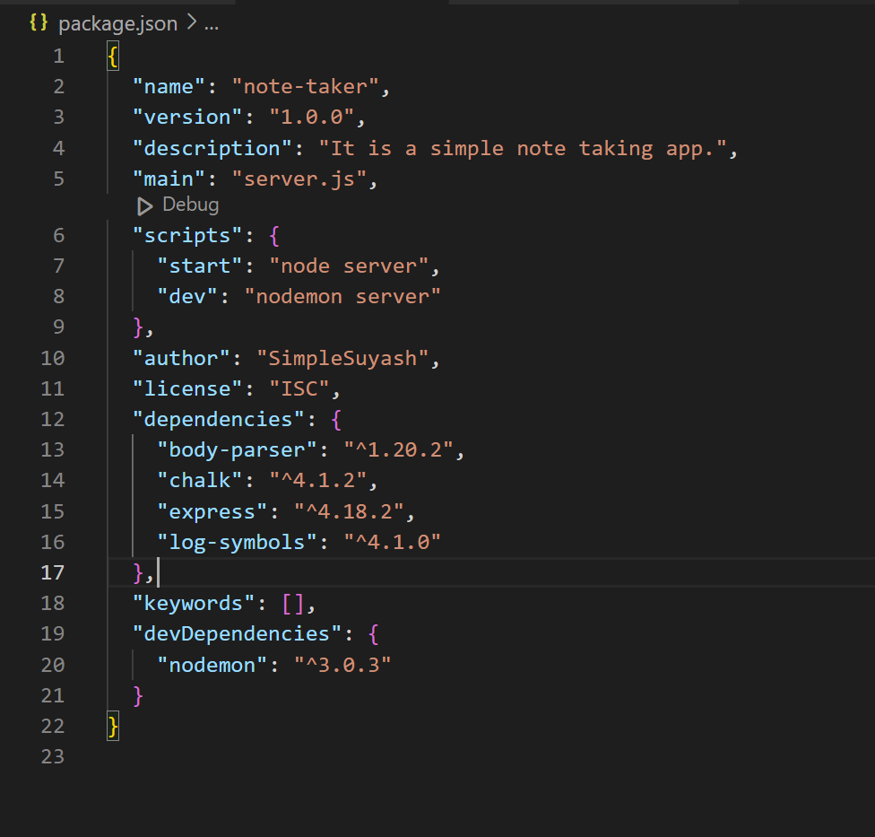
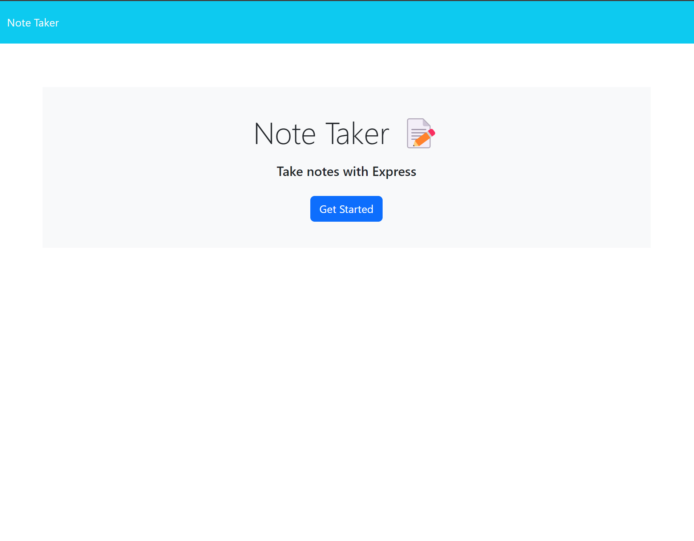
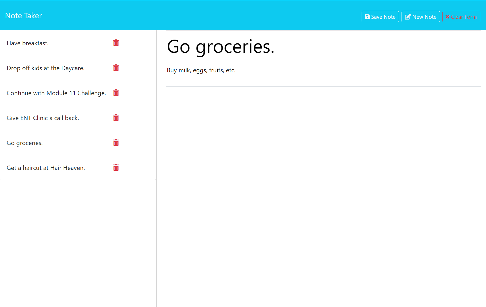

[](https://expressjs.com/) [](https://nodejs.org/en) [](https://www.npmjs.com/) 


<div align="right"> 
<a href= "http://www.wtfpl.net/about/"></a>
</div>

# Simple Note Taker    

This app lets users to write and save notes with title and description.

##  Description
During day to day busy hustle, notes can be a lifesaver. This app lets users write, save, view, edit and update, and delete the notes with a very simple user interface. 

By creating this project, I learnt to install the `Node.js` and the `npm`, and build and use `modules` which enable us to separate logically distinct part of the script into different scripting files. I also learnt to use various included packages in `node_modules` such as `chalk`, `figures`, `log-symbols`. I also learnt [`ANSI Escape Codes`](https://gist.github.com/fnky/458719343aabd01cfb17a3a4f7296797), which helps to change the style of console log text.  Last but not least, I learnt to create `APIs` and wire front-end client-side user interface to back-end server-side APIs.


## Table of Contents

1. [Installation](#installation)
1. [Usage](#usage)
1. [Licence](#licence)
1. [Screenshots](#screenshots)
1. [Demo](#demo)


## Installation 

1. Download and Install the `Node.js` 
1. Install `NPM` by typing
    ```       
    npm init -y
    ```
1. Install `Express`     
    ```         
    npm i express
    ```
1. Install `Body-Parser` Plugin
    ```
    npm i body-parser --save
    ```
1. Install `chalk` Plugin
    ```
    npm i chalk
    ```
1. Install `Log Symbols` Plugin
    ```
    npm i log-symbols
    ```
1. Install `Nodemon` Plugin as  Dev Dependency
    ```
    npm i -D nodemon
    ```
After installation of all the required plugins and packages, change the `script` value to  the following:            
       
    {            
        "start": "node server",               
        "dev": "nodemon server"                  
    }                  

And the `package.json` file should look like below:              


## Usage
During the development, 
- Open a new terminal in `Command Prompt` or `Git Bash` or `Visual Studio Code Terminal`
- Change directory to the parent folder of `server.js`
- Initiate the `Nodemon` by typing the following, which will automatically restart the server everytime the server-side code is changed.
    ```
    npm run dev
    ```
- Type the following in the broswer to open the app
    ```
    localhost:3001
    ```
## Licence

This app is licensed under [**WTFPL**](http://www.wtfpl.net/about/)

## Screenshots

Screenshot showing the Note Take app index page          


Screenshot showing notes page             


## Demo

https://github.com/SimpleSuyash/note-taker/assets/149545043/70a39bc1-fd93-45a1-80d7-a1bce54c6da1                        

## Deployed App    

[Please click to open the live app deployed to Heroku.](https://simplesuyash-note-taker-4a1f4afec235.herokuapp.com/)


